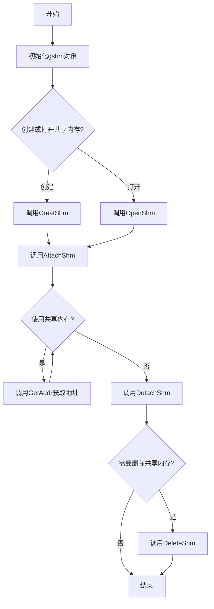

先启动Server程序，再启动Client程序，然后两个程序就可以互相通信了。

```bash
make
./Server
```

```bash
./Client
```

但是，对于退出来讲，需要先退出Client程序，再退出Server程序。

可以在Client的shell中直接按下键盘上的`Ctrl+c`杀死Client，然后相同操作杀死Server，即可正常删除shmid和fifo文件。

旨在为了应对存在多个Client和一个Server的情况，shmid由Server创建，也由Server删除。

shmMemory.hpp实现了一个共享内存的封装类 `gshm`，用于简化在 Linux/Unix 系统中使用共享内存的操作。

### 实现原理

1. **成员变量**：
   - `_key`：通过 `ftok` 函数生成的键值，用于标识共享内存段
   - `_shmid`：共享内存段的 ID，由 `shmget` 函数返回
   - `_addr`：共享内存段的起始地址，由 `shmat` 函数返回

2. **主要功能方法**：
   - `CreatShm()`：创建一个新的共享内存段
   - `OpenShm()`：打开一个已存在的共享内存段
   - `AttachShm()`：将共享内存段附加到进程的地址空间
   - `DetachShm()`：将共享内存段从进程的地址空间分离
   - `DeleteShm()`：删除共享内存段
   - `GetAddr()` 和 `GetShmId()`：获取共享内存的地址和 ID

### 用途

这个类主要用于进程间通信（IPC），允许多个进程访问同一块物理内存区域。共享内存是 IPC 中最高效的方式，因为数据不需要在内核和用户空间之间进行复制。

### 注意事项

1. **错误处理**：
   - 代码中使用了简单的错误处理，仅打印错误信息后返回。在实际应用中，可能需要更复杂的错误处理机制。
   
2. **资源释放**：
   - 析构函数 `~gshm()` 是空的，没有自动释放资源。使用时需要显式调用 `DetachShm()` 和 `DeleteShm()` 来释放资源。

3. **并发访问**：
   - 类中没有提供同步机制，如果多个进程同时读写共享内存，需要自行添加同步措施（如信号量）。

4. **权限问题**：
   - `CreatShm` 和 `OpenShm` 中的 `mode` 参数决定了共享内存的访问权限，需要根据实际需求设置。

5. **内存泄漏**：
   - 如果忘记调用 `DetachShm()`，可能会导致内存泄漏。

### 工作流程图

以下是使用 mermaid 绘制的共享内存操作流程图：



这个流程图展示了使用 `gshm` 类的基本操作流程：初始化对象、创建或打开共享内存、附加到进程地址空间、使用共享内存、分离共享内存，以及可选的删除共享内存步骤。